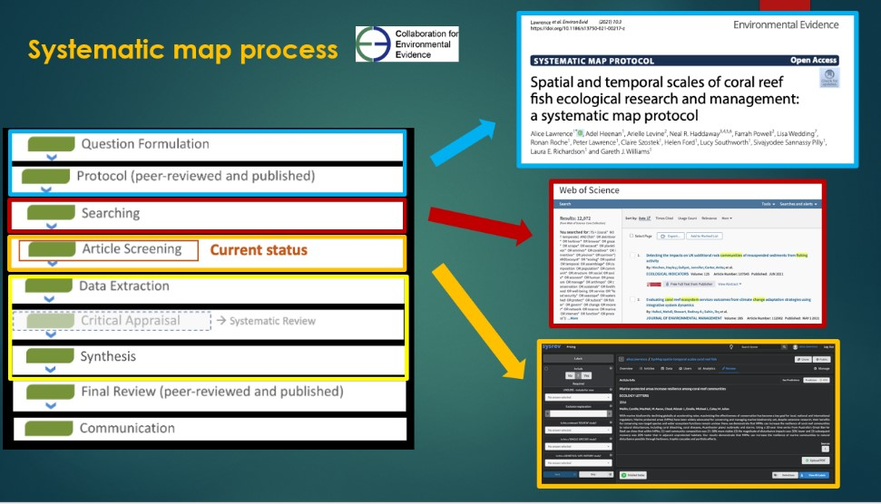
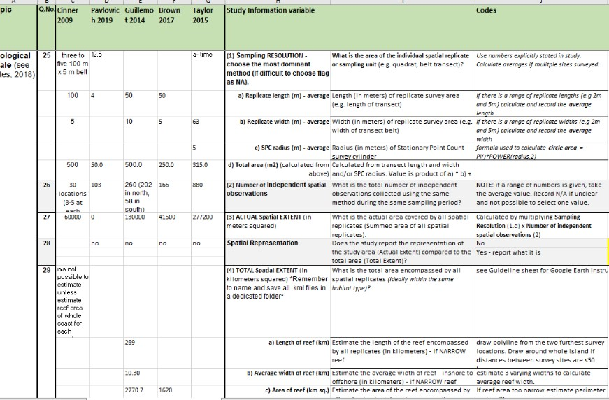
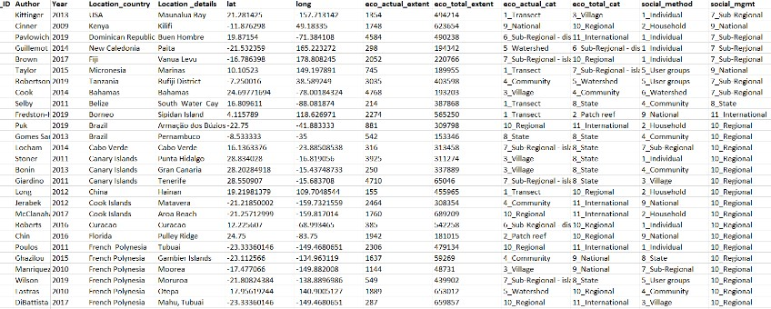
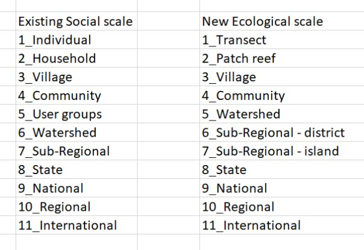
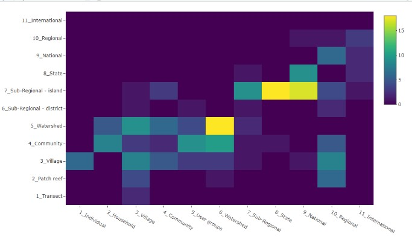
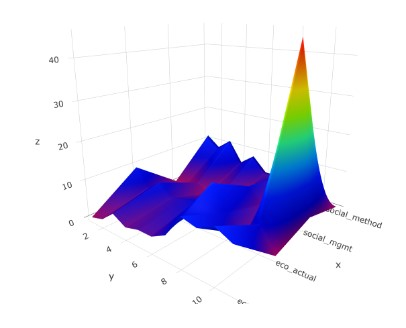
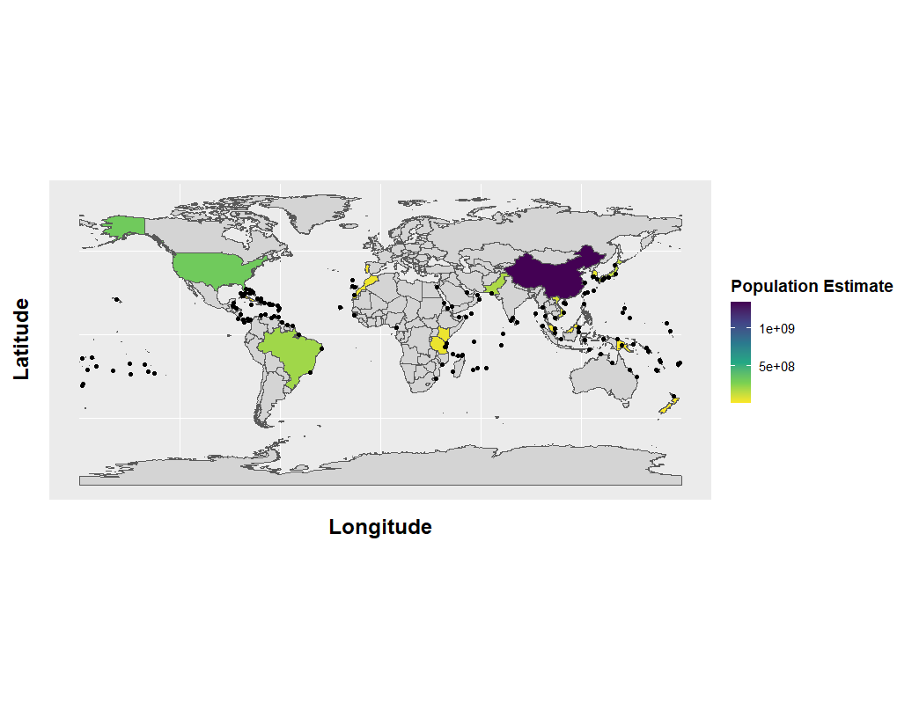

# reef-fish-sysmap

## What's it all about?

### Project Name: ###

#### The spatio-temporal scales of coral reef fish ecological research and management: a systematic evidence map ####

### Project Background: ### 

Use a systematic map process to understand:

- What spatial and temporal scales have been used in socio-ecological coral reef fish studies over the last 10 years

- The mismatches between the scale of empirical observations (ecological & social) AND the scale at which management inferences are made

- What gaps are in the evidence base, in a  systematic, transparent and repeatable way

#### Methods protocol published January 2021, [click here to read](rdcu.be/cecKn) ####

### Systematic Map Process: ### 

### Goals for the week: ### 

- How best to integrate quantitative ecological metadata with qualitative social metadata

- Can we develop an automated conversion factor based on geographical area and/or population of the study country?

### Workflow: ### 

1. Data organisation 
2. Solutions for integrating qualitative and quantitative data
3. Data visualisation 
4. Automated conversion factor

#### 1. Data organisation ####

- focus on key categories...

##### from this... #####

##### to this... #####

#### 2. Solutions for integrating qualitative and quantitative data ####

convert quantitative ecological scale to a qualitative scale similar to social scale categories

#### 3. Data visualisation - better understanding of how to extract the data more effectively ####

- Heat map - visualise hotspots 

Scale of Actual Extent of Ecological Observation vs Scale of Mangement Inference

- Surface plot (3D)

x = Scale of Ecological Observation,    
y = Scale of Social Observation,    
z = Scale of Management Inference

#### Link to interactive plot [click here](https://lab.sesync.org/rstudio/files/reef-fish-sysmap/heat%20map%20incomplete.html) ####

#### 4. Conversion Factors #### 

- Using population density to investigate patterns in scale mismatches between data collection and management inferences 

- Could also use marine area (EEZ) or GDP

- Need more time to automate the conversion factor process into social scale categories

### Lessons Learned: ### 

- How to use Git hub effectively

- How to streamline collaboration platforms

- How to create reproducible workflows --> essential for preparation for next phase of project

- Re-organising and visualising the data --> new categories will reduce effort needed for metadata extraction

### New tools: ### 

Implement some of new tools learned about during workshop:

- Colandr app - open access machine learning for conducting systematic reviews (use for location data etc)

- Environmental evidence database - interactive database of systematic maps

- WWF Marine Ecoregions GIS database - data download for use in R

- Contact with Samantha Cheng at American Museum of Natural History (systematic mapping experience)

### Next steps: ### 

- Continue screening and prepare for data extraction phase

- Reduce metadata extraction questions - more efficient

- Quantifying the social scale categories - calculate average communities / district sizes for each country

### Team Members ### 

- Alice Lawrence (University of Bangor, UK) @alice_fish00

- Lucy Southworth (University of Lancaster, UK) @SouthworthLucy

- Farrah Powell (San Diego State University, USA) @FarrahPowell

### Collaborators ### 

- Dr. Arielle Levine (San Diego State University, USA) 

- Dr. Adel Heenan (Global Fishing Watch) 

- Dr. Neal R Haddaway (Stockholm Environment Institute) 

- Dr. Lisa Wedding (University of Oxford, UK) 

- University of Bangor team: Dr. Gareth J. Williams, Dr. Peter Lawrence, Dr. Claire Szostek, Dr. Laura Richardson, Helen Ford, Sivajyodee Sannassy Pilly. 

