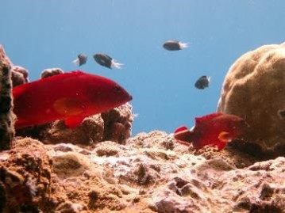
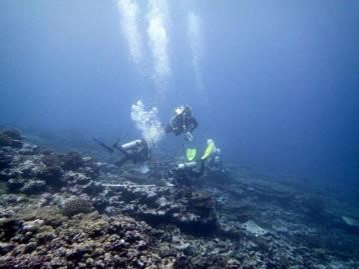
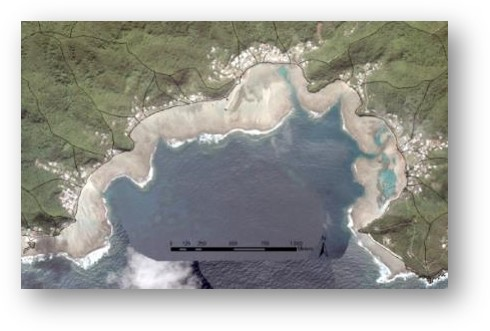

# reef-fish-sysmap

## what's it all about?

### Project Name ###

The spatio-temporal scales of coral reef fish ecological research and management: a systematic evidence map

### Project objectives: ### 

- Socio-ecological coral reef fish studies: what spatial and temporal scales have been used? 

- Understand the scale mismatch between:  
empirical / field observations (ecological & social)
management recommendations and inferences made
<<<<<<< HEAD
c) 	Identify gaps in evidence base – systematic, transparent and repeatable

Collaborators
- Alice Lawrence
- Lucy Southworth
- Farrah Powell
- Adel Heenan
=======

- Identify gaps in evidence base – systematic, transparent and repeatable

#### Methods protocol published January 2021, [read here](rdcu.be/cecKn) ####

### Goals for the week: ### 

- How to integrate  quantitative ecological metadata with qualitative social metadata? 

- Can we develop an automated conversion factor based on geographical area and/or population of the study country?

### Contact us on Twitter at: ### 

- @alice_fish00

- @SouthworthLucy

- @FarrahPowell

- @AdelHeenan

=======

>>>>>>> 6daaadf2c09af03ca9badaf30c7fab4b14a647ae

>>>>>>> 7422a454cf1d33ba96d966226a16c3f4efa1b912
