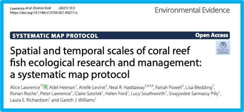
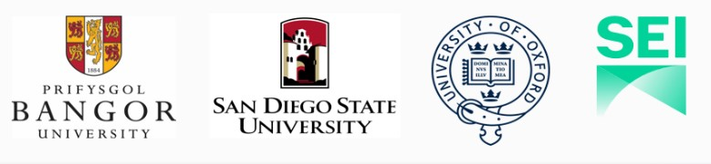

# reef-fish-sysmap

## What's it all about?

### Project Name: ###

The spatio-temporal scales of coral reef fish ecological research and management: a systematic evidence map

### Project objectives: ### 

- Socio-ecological coral reef fish studies: what spatial and temporal scales have been used? 

- Understand the mismatches between the scale of empirical observations (ecological & social) AND 
that scale at which management inferences are made

- Identify gaps in evidence base, in a  systematic, transparent and repeatable way

#### Methods protocol published January 2021, [read here](rdcu.be/cecKn) ####

### Goals for the week: ### 

- How to integrate  quantitative ecological metadata with qualitative social metadata? 

- Can we develop an automated conversion factor based on geographical area and/or population of the study country?

### Collaborators ### 

- Alice Lawrence (University of Bangor, UK) @alice_fish00

- Lucy Southworth (University of Lancaster, UK) @SouthworthLucy

- Farrah Powell (San Diego State University, USA) @FarrahPowell

- Dr. Adel Heenan (Global Fishing Watch) @AdelHeenan

- Dr. Arielle Levine (San Diego State University, USA) 

- Dr. Neal R Haddaway (Stockholm Environment Institute) 

- Dr. Lisa Wedding (University of Oxford, UK) 

- Dr. Ronan Roche (University of Bangor, UK)

- Dr. Peter Lawrence (University of Bangor, UK)

- Dr. Claire Szostek (University of Bangor, UK)

- Helen Ford (University of Bangor, UK)

- Sivajyodee Sannassy Pilly (University of Bangor, UK)

- Dr. Laura Richardson (University of Bangor, UK)

- Dr. Gareth J. Williams (University of Bangor, UK)

